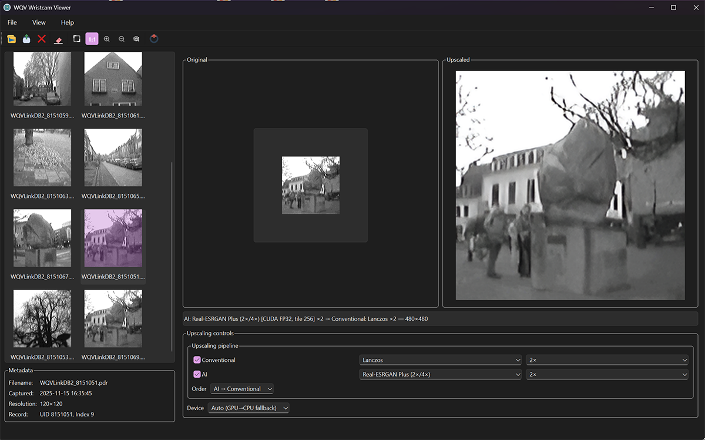
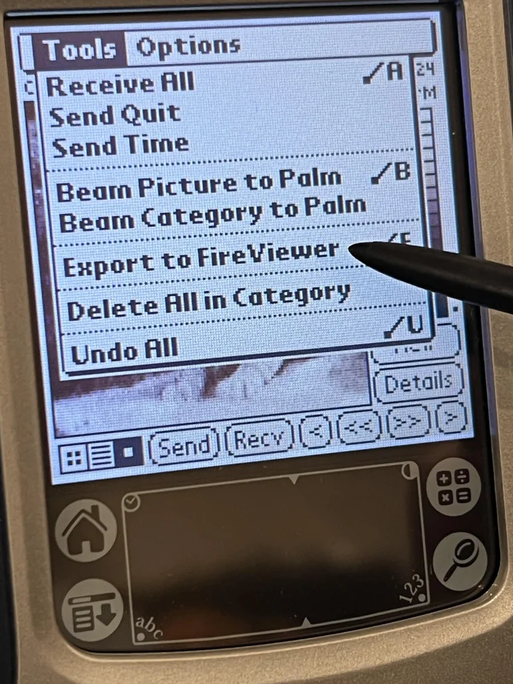

# WQV Wristcam Viewer & Trainer

WQV-Viewer is a PyQt6 desktop application and companion NeoSR trainer built for the Casio WQV wrist cameras. It decodes Palm backups, previews captures, upscales them with configurable pipelines, and ships a training toolchain for producing new Real-ESRGAN style weights tuned to wristcam footage.

## Highlights
- Pure-Python parser loads WQVLink Palm databases, raw monochrome dumps, and colour JPEG exports while preserving capture metadata.
- Responsive dual-pane GUI with thumbnail grid, metadata panel, multi-selection export, and asynchronous upscaling workers that keep the interface responsive.
- Configurable pipeline that mixes conventional resamplers with Real-ESRGAN variants, includes GPU/CPU device policies with automatic fallback, and lets you flip the processing order.
- Bundled Real-ESRGAN weights plus repository-supplied custom checkpoints (`models/custom/wqv_neosr_x4.pth` and `models/custom/wqv_neosr_x8.pth`) that appear alongside the stock models in the UI.
- Export flow writes PNGs with embedded JSON metadata, drops readable sidecars, remembers destinations, and provides progress plus cancel controls for long AI runs.
- `wqv-upscale-trainer` CLI creates synthetic WQV degradations, manages train/val/test splits, tracks EMA checkpoints, logs to TensorBoard, and emits deployable weights ready for the viewer.

## Interface Preview



## Requirements
- Python 3.9 or newer with pip available on your PATH.
- Desktop platform with Qt 6 support (Windows, macOS, or modern Linux).
- NVIDIA CUDA GPU recommended for Real-ESRGAN acceleration, but CPU mode is available.
- Sufficient disk space for model weights (`models/realesrgan` and `models/custom`).

## Installation
1. Clone the repository and open a shell inside `WQV-Viewer`.
2. Install the project in editable mode (this pulls in PyQt6, Torch, Real-ESRGAN, and pytest):
   ```bash
   python -m pip install -e .[dev]
   ```
3. (Optional) Verify that PyTorch detects your GPU: `python -c "import torch; print(torch.cuda.is_available())"`.

> Offline installs: download the Real-ESRGAN weights you need and place them under `models/realesrgan` before launching the viewer. The viewer will skip network downloads when the files already exist.

Prefer a containerized environment? Follow the noVNC-enabled workflow in [`readme_wqv_docker.me`](readme_wqv_docker.me).

## Launching the viewer

Run the desktop application from the project root:

```bash
python -m wqv_viewer
```

### Loading wristcam archives
- Use **File -> Open WQVLinkDB...** to browse for Palm backups (`.pdb`). The viewer extracts every record into the thumbnail grid and updates the metadata pane with filename, capture time (when available), resolution, and Palm record identifiers.
- Drag and drop a `.pdb` file onto the window instead of using the dialog. Drops are validated before loading.
- The **Open Recent** submenu tracks the last ten databases. Missing files are removed from the list automatically.
- **File -> Clear** unloads the current session while leaving recent history intact. The last database, selection signature, pipeline settings, and window geometry are restored on the next launch via `QSettings`.



### Navigating and previewing
- Thumbnails support standard Ctrl/Shift multi-selection. Selecting an item refreshes the dual preview panes: the original capture on the left and the active pipeline result on the right.
- The metadata group stays in sync with the selection so you can inspect record numbers before deleting or exporting.
- Fit/Actual zoom modes are exposed as toggle actions and tool buttons; `Ctrl` + mouse wheel, standard Zoom In/Out shortcuts, and `Ctrl+0` are all supported. Zoom mode applies to both panes simultaneously.
- The thumbnail list exposes the registered context actions, including **Delete Selected**, so you can manage records without leaving the viewer.

### Upscaling pipeline controls
- The **Conventional** row lets you choose a Pillow resampler (nearest, bilinear, bicubic, Lanczos) and one of the allowed scale factors (2x through 6x).
- The **AI** row activates Real-ESRGAN models. Pick a variant, select the scales it supports (2x, 4x, or 8x depending on the weights), and choose whether the AI stage runs before or after the conventional stage via the **Order** combo box.
- The **Device** selector honours Auto (GPU with CPU fallback), GPU only, or CPU only. If a GPU attempt fails, the pipeline retries on CPU and shows the fallback in the status summary.
- Every upscale runs in a background worker thread. The status bar hosts a progress widget with a **Cancel** button so you can interrupt long jobs without freezing the UI.
- The primary status label reports the active pipeline summary, including the models used, scale multipliers, and whether a fallback policy was triggered.

### Exporting images
- Highlight one or more thumbnails and pick **File -> Export Selected...**. The viewer runs the current pipeline for each selection, writes PNG files, and stores a matching `.json` sidecar containing the full metadata payload.
- When filenames collide, an incrementing numeric suffix is applied to both the PNG and JSON to avoid overwriting prior exports.
- The last export directory is remembered per session. Success, partial failure, and error cases are surfaced through the status bar.

### Managing Palm databases
- **Delete Selected** removes records directly from the backing `WQVLinkDB.PDB`. Selections spanning multiple databases are rejected to prevent accidental cross edits.
- Before deleting, the viewer confirms how many records will be purged and cross-checks metadata to ensure a valid Palm record mapping exists.
- After deletion the database is reloaded in-place so you can verify the updated contents immediately.

### Session persistence and quality-of-life
- Window geometry, splitter positions, zoom mode, pipeline configuration, last loaded database, and last selection are all saved in your user profile (`QSettings`).
- Application icons ship under `resources/` for both Windows and cross-platform use. The window icon refreshes automatically if the palette changes.
- Logs follow the standard Python logging configuration and are written alongside your session profile, making it easy to inspect pipeline failures.

## Upscaling models

### Bundled Real-ESRGAN variants
- Real-ESRGAN Plus 2x and 4x (classic RRDBNet models).
- Real-ESRGAN Sber 2x, 4x, and 8x (ai-forever RRDBNet weights for aggressive upscaling).
- General x4v3 and General x4v3 WDN (SRVGG weights with optional denoise blend control).
- Anime x4plus 6B and AnimeVideo v3 (tailored for stylised footage but useful for crisp wristcam lines).
- RealESRGAN general-purpose weights live under `models/realesrgan` and can be refreshed manually if new upstream releases appear.

### Repository custom models
- `models/custom/wqv_neosr_x4.pth` is a trainer-produced RRDB variant tuned on WQV monochrome material for 4x enlargements.
- `models/custom/wqv_neosr_x8.pth` extends the same recipe to 8x upscaling by chaining an extra NeoSR upsample stage.
- Both models were trained with high-resolution imagery sourced from the [Flickr2K dataset](https://www.kaggle.com/datasets/daehoyang/flickr2k).
- Both weights are auto-discovered on startup and appear in the AI dropdown as `Custom: wqv_neosr_x4 (x4)` and `Custom: wqv_neosr_x8 (x8)`. Select them whenever you want a wristcam-biased baseline before or after conventional resampling.

### Adding your own weights
- Drop additional `.pth` files into `models/custom`. Include the target scale (`x2`, `x4`, or `x8`) in the filename so the loader can infer supported scales.
- Restart the viewer to pick up new weights. Each file is listed under a `Custom:` label based on its stem so you can tell variants apart.
- Stale copies in `models/realesrgan` are cleaned up automatically when their custom counterpart disappears, keeping the directory tidy.

## Trainer CLI

### What the trainer does
- Scans a source directory for PNG/JPEG/TIFF assets and creates reproducible synthetic low-res/high-res pairs that mimic WQV compression and noise.
- Splits the dataset into train/validation/test partitions with deterministic shuffling and exposes per-split dataloaders.
- Supports optional monochrome simulation (`--monochrome-style`, `--monochrome-levels`, `--monochrome-noise`) to better match wristcam tonal ranges.
- Trains RRDB/NeoSR generators with automatic mixed precision, gradient accumulation, EMA tracking, and Adam hyper-parameters that you can override.
- Writes checkpoints at configurable intervals, including deployable `*_deploy.pth` snapshots and TensorBoard summaries (scalars plus LR/SR/HR comparison grids).

### Run a training session

```bash
wqv-upscale-trainer data/highres workspace/run-x4 --scale 4 --steps 150000 \
  --batch-size 8 --grad-accum-steps 2 --tensorboard --monochrome-style \
  --perceptual-weight 0.05 --device auto
```

- `data/highres` contains your lossless source material; the trainer augments and crops it automatically.
- `workspace/run-x4` is created on demand and stores configs, logs, checkpoints, and final models.
- Adjust `--scale` to 2, 4, or 8; the generator architecture adapts automatically.
- Resume training any time with `--resume path/to/checkpoint.pth`.
- Disable AMP with `--no-amp` when running strictly on CPU hardware.

### Outputs and deployment
- `workspace/run-x4/trainer.log` captures console logs for later review.
- `workspace/run-x4/dataset_splits.json` records the exact mapping between files and splits.
- `workspace/run-x4/checkpoints/` stores periodic checkpoints alongside `*_deploy.pth` exports that already contain the slim `{"params": ...}` payload.
- The best EMA snapshot is saved to `workspace/run-x4/models/wqv_neosr_x4.pth`; copy it into `models/custom` so the viewer can pick it up on the next launch.
- The repository’s own `wqv_neosr_x4.pth` and `wqv_neosr_x8.pth` under `models/custom` were produced with this workflow and serve as reference baselines.

## Testing

Run the automated tests from the project root:

```bash
python -m pytest
```

The suite covers the parser, pipeline helpers, and a headless Qt smoke test (`QT_QPA_PLATFORM=offscreen`) using the sample assets under `tests/data`.

## Troubleshooting
- **GPU fallback in status bar**: the viewer automatically retries on CPU when the GPU driver rejects a kernel launch; check your CUDA installation if this happens unexpectedly.
- **Missing Qt platform plugin**: ensure `python -m pip install -e .[dev]` completed successfully and that you are running within the same environment.
- **Model not listed in the AI dropdown**: confirm the `.pth` file name contains `x2`, `x4`, or `x8` and that it lives in `models/custom`.
- **Trainer cannot import TensorBoard**: install it explicitly with `python -m pip install tensorboard` when you pass `--tensorboard`.

## Credits

WQV-Viewer builds upon the research shared in the community project [WQV_PDB_Tools](https://github.com/nnnn2cat/WQV_PDB_Tools) and the outstanding Real-ESRGAN ecosystem maintained at [xinntao/Real-ESRGAN](https://github.com/xinntao/Real-ESRGAN). All trademarks belong to their respective owners; please review upstream licenses when redistributing model weights.


